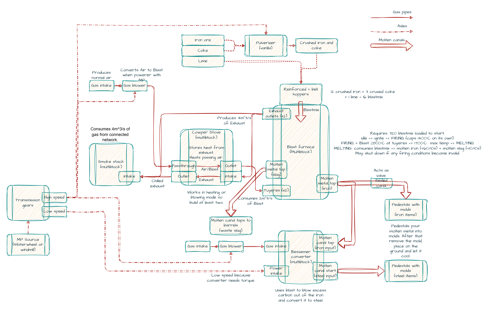

# Steelmaking Expanded

A [Vintage Story](https://www.vintagestory.at/) mod (modid `smex`) that adds
an industrial-era iron and steel production chain on top of vanilla metalworking:

- a multiblock **blast furnace** that smelts crushed ore into molten iron and slag,
- a **gas-pipe network** (air / blast / exhaust) with intakes, blowers, valves and a smoke stack,
- a **cowper stove** that recycles furnace exhaust into a hot blast to push the furnace past iron's melting point,
- a **molten-metal canal network** that pipes liquid metal into barrels and casting molds,
- a **Bessemer converter** that refines molten iron into steel using blast and mechanical power.



For the full survival production flow — what feeds what, gating, and tunables — see
[`graph.txt`](docs/graph.txt).

## Repository layout

| Path                     | Purpose                                                                                                                                                                          |
| ------------------------ | -------------------------------------------------------------------------------------------------------------------------------------------------------------------------------- |
| `SteelmakingExpanded/`   | The mod itself: C# code + JSON/asset content.                                                                                                                                    |
| `BlockNetworkLib/`       | Standalone library with the generic block-network framework (graph, nodes, per-tick dispatch). Compiled directly into the mod for now cause I don't want people crying just yet. |
| `BlockMigrationLib/`     | Standalone library with the generic block-migration framework (auto-rewrites renamed/re-variantted blocks in old saves as chunks load). Also compiled directly into the mod.     |
| `CakeBuild/`             | Cake build script project that packages the mod into a release zip.                                                                                                              |
| `VintageStory.sln`       | Solution tying the projects together.                                                                                                                                            |
| `build.ps1` / `build.sh` | Convenience wrappers that run the Cake build.                                                                                                                                    |

## Code structure (`SteelmakingExpanded/`)

Code is organized by **feature**, and within each feature by Vintage Story's
`Block` / `BlockEntity` split:

- **`Block*`** classes = the block definition (placement, orientation, interaction routing, drops).
- **`BlockEntity*`** classes = the per-tile state and logic (ticking, inventory, networks, rendering).

```
Networks/                  Shared network systems
  Gas/                     Air / blast / exhaust gas network
    GasNetwork.cs          Live network: volume, temperature, gas-type mixing, merge/split/tick
    GasTypes.cs            GasNetworkState + IGasProducer / IGasConsumer / IGasPressureValve
    Blocks/ , BlockEntities/   Pipes, valve, pressure valve, blower, intake, outlet, passthrough
  Molten/                  Liquid-metal canal network
    MoltenNetwork.cs       Live network: amount, temperature, solidification, merge/split/tick
    MoltenTypes.cs         MoltenNetworkState + fill-quad defs
    MoltenRenderer.cs      Glowing molten-surface renderer (canals, taps, barrels, molds)
    Blocks/ , BlockEntities/   Canal pieces, start, tap, mold pedestal, molten barrel

Structures/                The big multiblock machines
  BlockEntityMultiblockStructure.cs   Base class: completion monitor + production tick
  BlastFurnace/            Furnace, taps, tuyeres, hoppers, slag/iron blocks, blast-mix item
  BessemerConverter/       Control, converter vessel, gas intake, transmission (+ MP behavior)
  CowperStove/             Regenerator intake + heat sink
  SmokeStack/              Exhaust vent

Overrides/                 Drop-in replacements for vanilla classes
                           (coal pile, tool mold, mold rack) to add mod behavior

Migrations/                Per-block save migrations (IBlockCodeMigration implementations)
                           that rewrite old block codes when variants change

SteelmakingExpandedModSystem.cs   Entry point: registers every block/BE/item/behavior class,
                                  the creative tab, network types, global player effects, patches
SmexSounds.cs              Shared sound asset locations + server-side play helpers
SmexValues.cs              Gameplay tunables (SmexConfig) loaded from ModConfig/smex.json,
                           exposed through the static SmexValues accessor
```

## Network system (`BlockNetworkLib/`)

Both the gas and molten systems are instances of one generic block-network framework.
A network is a connected graph of same-type nodes; the library owns only the
**graph-level** work (which blocks belong together, how they merge when joined and
fracture when broken, and per-tick dispatch), while each concrete network owns its
typed state and rules.

- `INetworkNode` — the block-entity-facing contract: reports its connector faces
  (`Orientation`), its `NetworkType`, the open/leaking faces handed back by the tick,
  and receives state pushes so clients can update their display.
- `BlockNetworkNode` — the `Block` base for self-orienting nodes: reads the shape family
  (`Type`) and connector faces (`Orientation`) from the block's variant code, computes
  the valid orientations from neighbouring same-network blocks on placement, and supports
  wrench rotation (`IWrenchOrientable`).
- `BlockEntityNetworkNode` — the `BlockEntity` base that registers/unregisters the node
  with the manager on load/removal, persists orientation and network state, and forwards
  network updates to the concrete block entity.
- `BlockNetwork` — the abstract live-network instance. Each subclass (`GasNetwork`,
  `MoltenNetwork`) owns its typed `State`, its node set, and all type-specific operations
  (producers/consumers, merge/split, tick); the manager never reaches into them.
- `BlockNetworkModSystem` — the graph manager: holds every live network, resolves
  `GetNetworkAt(pos)`, runs the BFS merge on `AddNode` and fracture detection on
  `RemoveNode`, and drives the per-tick dispatch. Concrete network types register a
  factory via `RegisterNetworkType("gas", …)` during `ModSystem.Start`.

To add a new network type: implement a `BlockNetwork` subclass (typed state + rules)
with matching `BlockNetworkNode` / `BlockEntityNetworkNode` blocks, and register its
factory with `RegisterNetworkType`. The graph, merging, fracturing and ticking come for
free.

## Migration system (`BlockMigrationLib/` + `Migrations/`)

When a block's code changes between mod versions — most often because a new variant
group is added (e.g. giving the gas passthrough/outlet/heated-intake a `brick` variant,
or the cowper/smoke-stack intake a refractory `tier`) — the engine keeps every already
placed instance as a "missing" placeholder block that retains its **original** code, so
no world data is lost. The migration system rewrites those placeholders to their current
equivalent in-place as chunks load, server-side only.

- `BlockMigrationLib/` is the generic, mod-agnostic framework:
  - `IBlockCodeMigration` — declares `(oldCode → newCode)` remap pairs; implement it
    (with a public parameterless constructor) for each set of renamed blocks.
  - `IBlockEntityMigration` — optional opt-in for migrations that must also copy/reshape
    the old block entity's saved state onto the new one (the default is a stateless swap).
  - `BlockMigrationModSystem` — auto-discovers every `IBlockCodeMigration` in the mod
    assembly, builds one merged remap table, and swaps matching blocks both in a one-time
    sweep of already-loaded chunks and on every `ChunkColumnLoaded` afterwards. Pairs whose
    old or new code is absent in the current world are skipped, so returning the full set
    unconditionally is safe.
- `SteelmakingExpanded/Migrations/` holds this mod's concrete migrations (e.g.
  `BrickVariantMigration`), which only enumerate the old/new code pairs; all the chunk
  scanning and block swapping lives in the library.

To add a migration: drop a new `IBlockCodeMigration` into `Migrations/` returning the
legacy→current code pairs. No registration is needed — discovery is by reflection.

## Overrides — these might conflict with other mod behavior

The classes in `Overrides/` are **not** new mod blocks. They are subclasses of
vanilla classes that get re-registered under the **vanilla class name** in
`SteelmakingExpandedModSystem`:

```csharp
api.RegisterBlockEntityClass("CoalPile", typeof(CustomBlockEntityCoalPile));
api.RegisterBlockEntityClass("ToolMold", typeof(CustomBlockEntityToolMold));
api.RegisterBlockClass("BlockToolMold", typeof(CustomBlockToolMold));
api.RegisterBlockClass("BlockMoldRack", typeof(CustomBlockMoldRack));
```

**Purpose:** inject mod behavior into blocks the mod does not own, so it works on
the _existing vanilla blocks_ without re-skinning them or shipping a parallel copy:

- `CustomBlockEntityCoalPile` — a blast-mix pile burns down to slag unless a furnace is managing it.
- `CustomBlockEntityToolMold` — restores a filled mold's contents when it is placed back in the world.
- `CustomBlockToolMold` — refines the right-click flow: extract the cast item first, then pick up the mold.
- `CustomBlockMoldRack` — spills a still-molten mold when it is racked.

## Assets (`SteelmakingExpanded/assets/smex/`)

Standard Vintage Story asset tree:

- `blocktypes/`, `itemtypes/`, `shapes/` — block/item definitions and models.
- `recipes/` — `grid/` (crafting), `clayforming/` (molds), `barrel/` (mortar from slag).
- `patches/` — JSON patches into vanilla (e.g. adding coke crushing properties).
- `lang/en.json` — all display names, HUD strings, and block-interaction help.
- `config/handbook/` — survival handbook guide pages.

## Finding things

- **A block's behavior** lives next to its block class under the matching feature folder;
  the block/entity/item/behavior/override class wiring is all in `SteelmakingExpandedModSystem`.
- **A piece of UI text** (name, tooltip, error) is a `smex:`-prefixed key in `lang/en.json`.
- **Network rules** (capacity, mixing, cooling, leaks) live in `GasNetwork`/`MoltenNetwork`,
  not in the block entities, which only call into them.

## Building

Requires the .NET SDK and a Vintage Story install with the `VINTAGE_STORY`
environment variable pointing at it (the `.csproj` references game DLLs from there).

```sh
dotnet build SteelmakingExpanded/SteelmakingExpanded.csproj   # compile the mod
./build.ps1   # or ./build.sh — full Cake build, produces a packaged release zip
```

Also, if you use VS Code like me, there is already launch config for it, simply
put your path to Vintage Story install in the `VINTAGE_STORY` env var.
